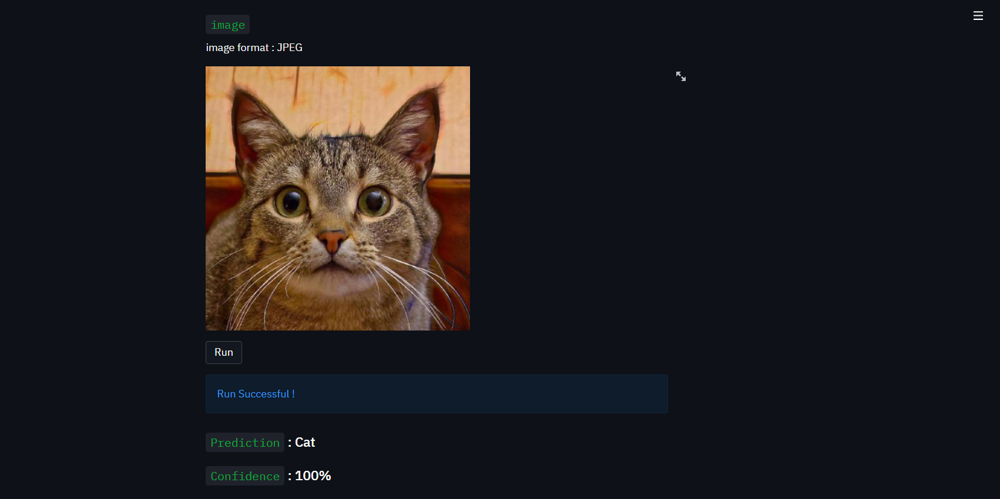

# Animal-Face-Classifier-App
This is a simple image classification web app to predict animal faces into three classes `cats, dogs and wild`.

<figure class="video_container">
  <video controls="true" allowfullscreen="true" poster="demo_video/poster-image.png">
    <source src="demo_video/streamlit-app-demo-video.mp4" type="video/mp4">
  </video>
</figure>